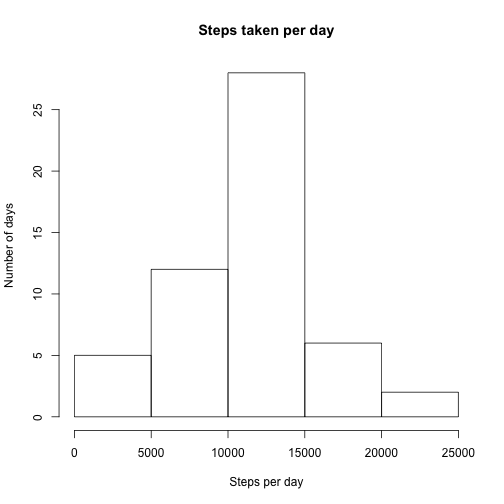
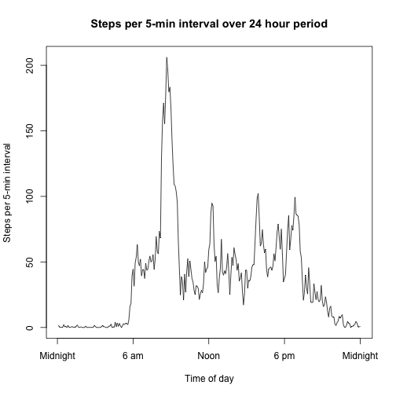
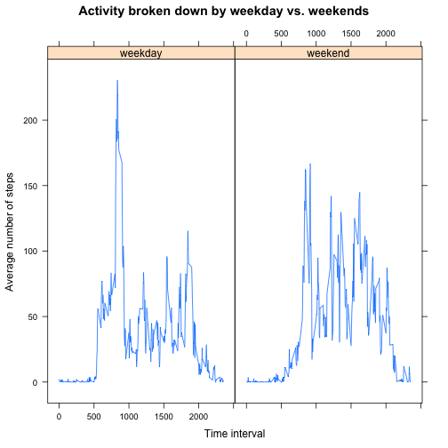

## Loading and preprocessing the data

First we will read in the csv into a dataframe called activity.

```r
activity <- read.csv("activity.csv",header=T)
```

```
## Warning in file(file, "rt"): cannot open file 'activity.csv': No such file
## or directory
```

```
## Error in file(file, "rt"): cannot open the connection
```

## What is mean total number of steps taken per day?

Next, we will use the ddply function from the plyr package to find the total number of steps taken each day. Then we will find the mean and median of that.


```r
library(plyr)
daily.data<-ddply(activity, ~date, summarize, dailytotal=sum(steps))
mean(daily.data$dailytotal,na.rm=T)
```

```
## [1] 10766.19
```

```r
median(daily.data$dailytotal,na.rm=T)
```

```
## [1] 10765
```

```r
hist(daily.data$dailytotal, main="Steps taken per day", xlab="Steps per day", ylab="Number of days")
```

 

Both the mean and median number of steps per day are around 10,800 steps.

## What is the average daily activity pattern?

Now we will look at daily activity patterns, averaged across all days in the data, and find what five-minute interval is most active on average.


```r
interval.data<-aggregate(activity$steps, by = list(activity$interval), FUN=mean,na.rm=T)
plot(interval.data$x,type="l", xlab="Time of day", ylab="Steps per 5-min interval", main="Steps per 5-min interval over 24 hour period", xaxt="n")
axis(side=1,at=c(0,72,144,216,288),labels=c("Midnight","6 am", "Noon", "6 pm", "Midnight"))
```

 

```r
interval.data[which.max(interval.data[,2]),]
```

```
##     Group.1        x
## 104     835 206.1698
```

Peak activity (as measured by steps) appears to occur around 8:35 am on average.

## Imputing missing values

To impute missing values, first we'll determine the number of missing observations using the summary command.

```r
summary(activity$steps)
```

```
##    Min. 1st Qu.  Median    Mean 3rd Qu.    Max.    NA's 
##    0.00    0.00    0.00   37.38   12.00  806.00    2304
```

There seem to be 2304 missing observations. For each missing observation, we'll use the average for that time interval. We'll make a new dataframe first in which to add missing values.


```r
imputed.data<-activity
names(interval.data)[names(interval.data)=="Group.1"] <- "interval"
names(interval.data)[names(interval.data)=="x"] <- "interval.avg"
imputed.data<-merge(imputed.data, interval.data, by=c("interval"))

for(i in 1:length(imputed.data$steps)){
    if(is.na(imputed.data$steps[i])){
        imputed.data$steps[i] <-imputed.data$interval.avg[i]
        }
    }
```

Now, we will check to make sure there are no more missing values and repeat the first part of this data analysis using imputed missing values.


```r
summary(imputed.data$steps)
```

```
##    Min. 1st Qu.  Median    Mean 3rd Qu.    Max. 
##    0.00    0.00    0.00   37.38   27.00  806.00
```

```r
daily.imputed.data<-ddply(imputed.data, ~date, summarize, dailytotal=sum(steps))
mean(daily.imputed.data$dailytotal,na.rm=T)
```

```
## [1] 10766.19
```

```r
median(daily.imputed.data$dailytotal,na.rm=T)
```

```
## [1] 10766.19
```

Because we filled in missing values by averaging within five-minute intervals, the mean remained the same. The median total is equal to the mean, perhaps because the median of the imputed data daily totals consisted of a day in which it was necessary to fill in values for all time intervals.

## Are there differences in activity patterns between weekdays and weekends?

Now we split the data by weekends vs weekdays:


```r
imputed.data$day<-weekdays(as.Date(imputed.data$date))
weekday<-c("Monday","Tuesday","Wednesday","Thursday","Friday")
imputed.data$weekend.or.weekday<-as.factor(ifelse(imputed.data$day %in% weekday, "weekday", "weekend"))
```

We'll look at the average number of steps per interval, but split according to weekdays vs weekends.


```r
averaged.by.day <-aggregate(steps~weekend.or.weekday+interval,data=imputed.data,FUN=mean)

library(lattice)
xyplot(steps~interval|weekend.or.weekday, data=averaged.by.day, main = "Activity broken down by weekday vs. weekends", xlab="Time interval", ylab="Average number of steps", type="l")
```

 

Most notably, we can observe that weekdays show a spike in the morning (perhaps getting ready or a commute), and weekends show a little more evening activity.
